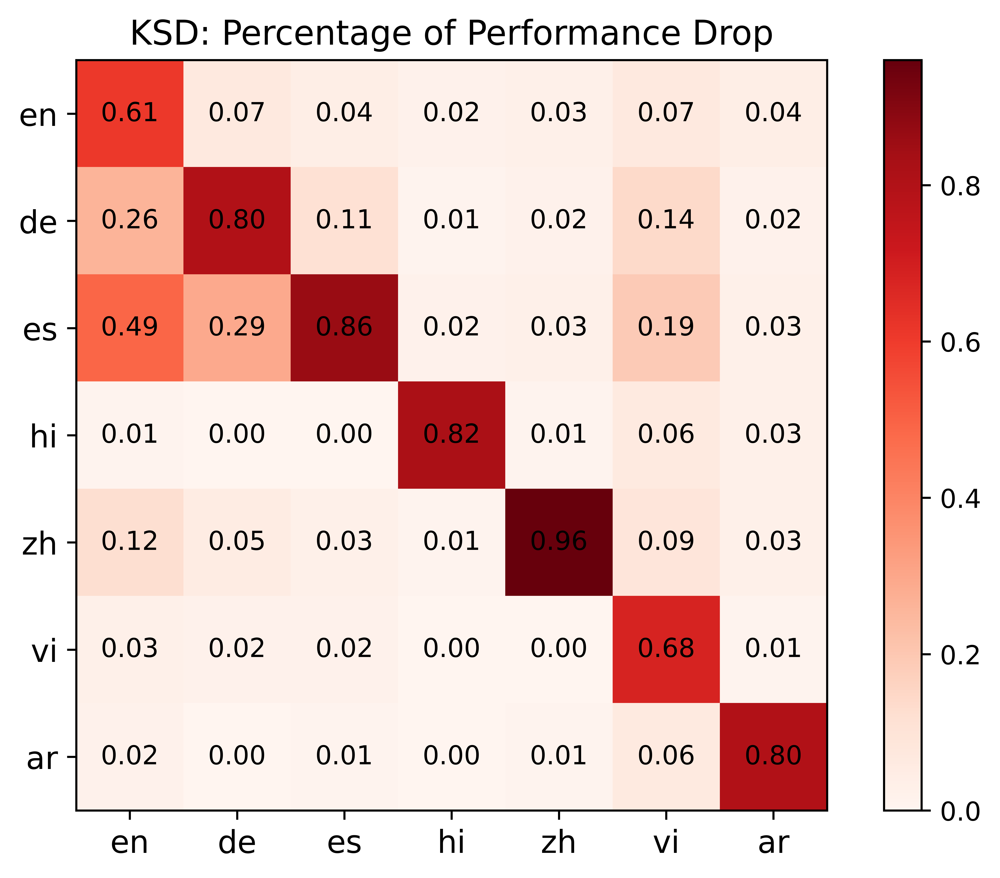

# Effective Skill Unlearning through Intervention and Abstention

This is the official repository for our paper: **Effective Skill Unlearning through Intervention and Abstention**, NAACL 2025.
In this work, we propose two *lightweight*, *training-free*, and *effective* techniques for skill unlearning:  
- **Method 1: Neuron Adjust** unlearns one skill by shifting selected feed-forward layer neurons' pre-activation value from the forgetting skill distribution to the retaining skill distribution.
- **Method 2: Key Space Detection** unlearns one skill by abstaining the model's output when the model's inference time key vector falls in the forgetting skill hypercube.

<p align="center">

</p>
<p align="center">
<em>Overview of our two skill unlearning methods: Neuron Adjust and Key Space Detection</em>
</p>

## Table of Contents

- [Set up](#set-up)
- [Example Usage](#example-usage)
  - [Neuron Adjust](#neuron-adjust)
    - [Overview](#overview)
    - [Quick Start](#quick-start)
  - [Key Space Detection](#key-space-detection)
    - [Overview](#overview)
    - [Quick Start](#quick-start)
- [Key Results](#key-results)
- [Cite this work](#cite-this-work)

## Set up
Python (3.10), [Pytorch 2.2.1](https://pytorch.org/get-started/previous-versions/), and CUDA 12.1 recommended. 

Install the packages: 

```
pip install -r requirements.txt
```

We provide an instruction on evaluating the methods on MLQA dataset, unzip the dataset to correct folder

```
unzip MLQA_V1.zip && mv MLQA_V1 MLQA_data
```

set your own HF token in the environment variable.

```
export HF_TOKEN=<your_token>
```

## Example Usage

We provide two colab notebook to show the key space distribution (Figure 5,6 in the paper) in the FFL layer of the subject model. 

1. [Key vectors of a certain skill could be separated by a hypercube from other skills.](https://colab.research.google.com/drive/1ud9rxYN54_9WutLE9U2cURYtLuTLMxly?usp=sharing)
2. [Examine hypercubes volume and distance across different layers.](https://colab.research.google.com/drive/1CT_kwFqVTh_HQIURrO8uvZdSORuLXZ4C?usp=sharing)

In the following part, we provide example usage of **Neuron Adjust** and **KSD** methods.

### Neuron Adjust

<p align="center">

</p>
<p align="center">
<em>Overview of Neuron Adjust method</em>
</p>

#### Overview

**Neuron Adjust** method consists of three steps:
- Probe the model with the forgetting/retaining skill dataset, and get the neuron pre-activation distribution statistics (mean and stds).
- Based on the statistics, select the top k% neurons with the highest distributional difference to adjust.
- During inference, probablistically adjust the selected neurons' pre-activation values based on its likelihood of sampling from the forgetting distribution.

#### Quick Start

In this section, we provide example usage of evaluation on MLQA dataset using llama-3-8b. 

1. Probe the model with MLQA English dataset and get the probing statistics.
    ```
    python probe.py \
        --hook_type mean_std \
        --mlqa \
        --mlqa_forget en \
        --get_retain \
    ```
    This will generate the probing statistics and store it in ```./experiment_results/MLQA/```. You can change ```--mlqa_forget``` to other languages to get the probing statistics of other languages. You can set ```--gsm8k``` or ```--mbpp``` to get the probing statistics of GSM8K or MBPP dataset. See ```python probe.py --help``` for more detailed settings.

2. Generate adjusting file which stores the selected neurons' forgetting and retaining distribution statistics.
    ```
    python get_adjust_info.py 
    ```
    This will generate the adjust_neuron_info file and store it in ```./experiment_results/forget_layer_info/```.  See ```python get_adjust_info.py --help``` for more detailed settings.

3. Evaluate the model's performance on a certain language of MLQA dataset.
    ```
    python MLQA_evaluation.py \
        --model llama-3-8b \
        --adjust_neuron_info_path ./experiment_results/forget_layer_info/forget_en_retain_non_en_llama_3_8b_5_percent.pkl \
        --rule adjust \
        --language [language to test, choose from en, de, es, ar, zh, vi, hi]
    ```

We've also provided the example neuron_adjust info file after step 2 for forgetting MLQA-English and forget [Math/Code] task. 

Run ```./run_scripts/MLQA_original.sh``` file to evaluate the model's original performance on different languages (Change ```$LANG``` to the language you want to test). 

Run ```./run_scripts/NA_forget_language.sh``` file to evaluate the model's performance on different languages after unlearning English with Neuron Adjust (Change ```$TEST_LANG``` to the language you want to test)..

Run ```./run_scripts/NA_forget_{task1}_test_{task2}.sh``` file to evaluate the model's performance on task2 [GSM8K/MBPP] after unlearning task1 [MBPP/GSM8K] with NA method.

Additional step of [evaluation on MBPP](https://github.com/evalplus/evalplus/tree/master): Follow the instruction in the link to sanitize generated code and evaluate accuracy. 
```
evalplus.sanitize --samples [output jsonl file from MBPP_evaluation.py]
evalplus.evaluate --dataset mbpp --samples [sanitized output jsonl file]
```

### Key Space Detection

<p align="center">

</p>
<p align="center">
<em>Overview of Key Space Detection method</em>
</p>

#### Overview

**Key Space Detection** method mainly consists of three steps:
- Probe the model with the forgetting skill dataset, and get the probing key vector set.
- Based on the key vectors, form a skill hypercube. 
- During inference, if the inference time key vector fall in this hypercube, abstain the output.

#### Quick Start

In this repo, we provide example usage of evaluation on MLQA dataset using llama-3-8b.  

1. Probe the model with MLQA English dataset and get the probing statistics.
    ```
    python probe.py --mlqa --mlqa_forget en --hook_type all_stats 
    ```
    This will generate the probing statistics and store it in ```./experiment_results/MLQA/```. You can change ```--mlqa_forget``` to other languages to get the probing statistics of other languages. You can set ```--gsm8k``` or ```--mbpp``` to get the probing statistics of GSM8K or MBPP dataset. See ```python probe.py --help``` for more detailed settings.

2. Generate the hypercube info file which stores the hypercube mean and stds of the forgetting skill (now it's English).
    ```
    python aggregate_layer_info_dict.py
    ```
    This will generate the hypercube info file and store it in ```./experiment_results/forget_layer_info/```. See ```python aggregate_layer_info_dict.py --help``` for more detailed settings.

3. Evaluate the model's performance on a certain language of MLQA dataset.
    ```
    python MLQA_evaluation.py
        --adjust_neuron_info_path ./experiment_results/forget_layer_info/forget_en_llama_3_8b.pkl \
        --rule steer \
        --language [language to test, choose from en, de, es, ar, zh, vi, hi] \
        --model llama-3-8b
    ```

We've also provided the example hypercube info file after step 2 for forgetting math/code task. 

Run ```./run_scripts/MLQA_original.sh``` file to evaluate the model's original performance on different languages (Change ```$LANG``` to the language you want to test). 

Run ```./run_scripts/KSD_forget_language.sh``` file to evaluate the model's performance on different languages after unlearning English with KSD (Change ```$TEST_LANG``` to the language you want to test).

Run ```./run_scripts/KSD_forget_{task1}_test_{task2}.sh``` file to evaluate the model's performance on task2 [GSM8K/MBPP] after unlearning task1 [MBPP/GSM8K] with KSD method.

Additional step of [evaluation on MBPP](https://github.com/evalplus/evalplus/tree/master): Follow the instruction in the link to sanitize generated code and evaluate accuracy. 
```
evalplus.sanitize --samples [output jsonl file from MBPP_evaluation.py]
evalplus.evaluate --dataset mbpp --samples [sanitized output jsonl file]
```

## Key Results

Experiment results show good performance on forgetting code/math/specific language while retaining the overall knowledge (MMLU).

### Forget Math/Coding Skill
We tested our methods on forgetting Math/Code skill while retaining the other skill and the overall knowledge with gemma-2B, llama-2-7B, llama-3-8B, and llama-3-70B models. Experiment results show that our methods effectively unlearn the forgetting skill while retaining the model's overall knowledge. Specifically, KSD achieves >80% unlearning quality with minimal performance degradation (<10%) of other skills. 

<p align="center">

</p>
<p align="center">
<em>Unlearn Math/Code Experiment Results: SP (Selective Pruning Baseline), NA (Neuron Adjust) and KSD (Key Space Detection)</em>
</p>

### Forget Language Skill
We also tested our methods on forgetting one language while retaining the other languages on llama-3-8B model. The ith row is the drop of performance of unlearning the i-th language while testing all other languages. On most of the languages, KSD achieves >60% unlearning quality with <12% performance degradation of other language skills. 

<div style="display: flex; justify-content: center;">
  
  
</div>
<p align="center">
</p>

## Cite this work
Y. Li, C. Sun, and T.-W. Weng, Effective Skill Unlearning through Intervention and Abstention, NAACL 2025

```
@article{Li2025effective
    title={Effective Skill Unlearning through Intervention and Abstention},
    author={Li, Yongce and Sun, Chung-En and Weng, Tsui-Wei},
    journal={NAACL},
    year={2025},
}
```
